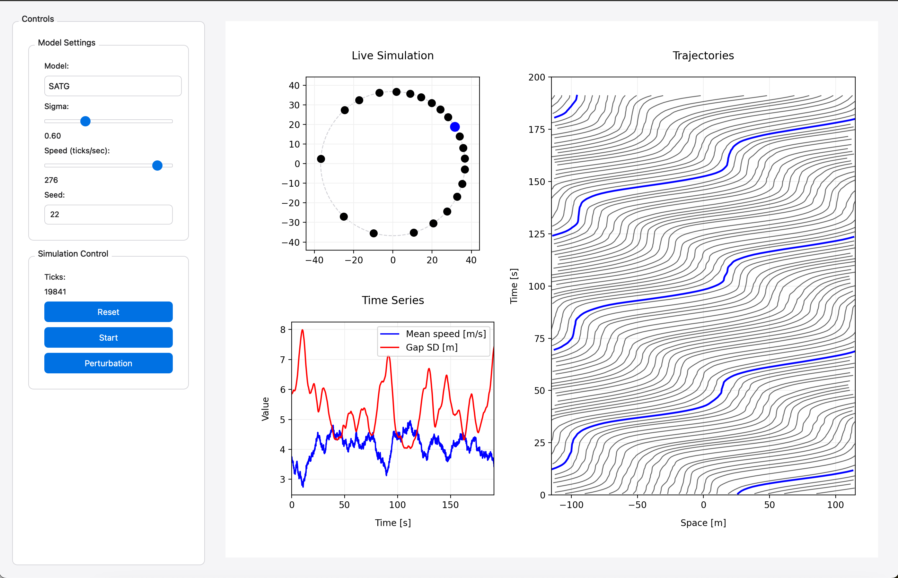

# Noise-Induced Traffic Simulation



A Python implementation of microscopic traffic flow models to study the emergence of stop-and-go waves in traffic systems, with a particular focus on noise-induced phenomena. This simulation compares different traffic models including the Optimal Velocity Mode (OVM) and the Intelligent Driver Model (IDM) model.

## Project Description

This simulation explores how different levels of noise and various model parameters affect traffic flow patterns, particularly the emergence of stop-and-go waves. It implements both stable and unstable variants of several traffic models, allowing for comparative analysis of traffic behavior under different conditions.

The project is inspired by the experiment by Sugiyama et al. [1], where 22 vehicles drive around a 231-meter long single-lane roundabout, starting from uniform initial conditions. After a transition period, stop-and-go waves emerge naturally (see youtube.com/watch?v=7wm-pZp_mi0).

## Features

- Multiple traffic flow models:
  - OVM (Optimal Velocity Model) [2]
  - FVDM (Full Velocity Difference Model)[3]
  - Tomer et al. model [4]
  - IDM (Intelligent Driver Model)[5]
  - ATG (Adaptive Time Gap) [6]


## Installation

1. Clone the repository:
```bash
git clone https://github.com/RaphaelKorb97/noise_induced_sim.git
cd noise_induced_sim
```

2. Create and activate a virtual environment (recommended):
```bash
python -m venv venv
source venv/bin/activate  # On Windows, use `venv\Scripts\activate`
```

3. Install the required dependencies:
```bash
pip install -r requirements.txt
```

## Usage

Run the simulation with:
```bash
python main.py
```

### Interface Overview
The simulation interface (shown above) provides:
- **Model Selection**: Choose between different traffic models
- **Noise Control**: Adjust the noise intensity (sigma) using the slider
- **Simulation Speed Control**: Modify the simulated ticks/sec
- **Perturbation Button**: Apply a braking perturbation to the blue vehicle
- **Reset Button**: Restart the simulation with current parameters

## Models

### OVM (Optimal Velocity Model) [2]
- **Stable Version**: Maintains smooth traffic flow
- **Unstable Version**: Can produce stop-and-go waves
- Key parameters: Sensitivity parameter τ (2.0 for stable, 1.0 for unstable)

### FVDM (Full Velocity Difference Model) [3]
- **Stable Version**: Combines optimal velocity and relative speed
- **Unstable Version**: Enhanced sensitivity to relative speed
- Key parameters: κ (2.0 for stable, 2.7 for unstable)

### Tomer et al. Model [4]
- **Stable Version**: Inertial model with balanced parameters
- **Unstable Version**: Increased sensitivity to speed differences
- Key parameters: K (7.0 for stable, 3.0 for unstable)

### IDM (Intelligent Driver Model) [5]
- **Stable Version**: Balanced acceleration and deceleration
- **Unstable Version**: Enhanced sensitivity to speed differences
- Key parameters: A (4.0 for stable, 5.0 for unstable)

### ATG (Adaptive Time Gap) [6]
- Adaptive time gap model with bounded parameters
- Smooth transitions between acceleration and deceleration

## References

[1] Sugiyama, Y., Fukui, M., Kikuchi, M., Hasebe, K., Nakayama, A., Nishinari, K., ... & Yukawa, S. (2007). Traffic jams without bottlenecks—experimental evidence for the physical mechanism of the formation of a jam. New Journal of Physics, 10(3), 033001.

[2] Bando, M., Hasebe, K., Nakayama, A., Shibata, A., & Sugiyama, Y. (1995). Dynamical model of traffic congestion and numerical simulation. Physical review E, 51(2), 1035.

[3] R. Jiang et al. Phys Rev E 64(1):017101 (2001)

[4] E. Tomer et al. Phys Rev Lett 84(2):382 (2000)

[5] M. Treiber et al. Phys Rev E 62(2):1805 (2000)

[6] A. Tordeux et al. Transp Res B: Meth 44(8-9):1115 (2010)

## Author

Dr. Raphael Korbmacher and Prof. Dr. Antoine Tordeux
korbmacher@uni-wuppertal.de
